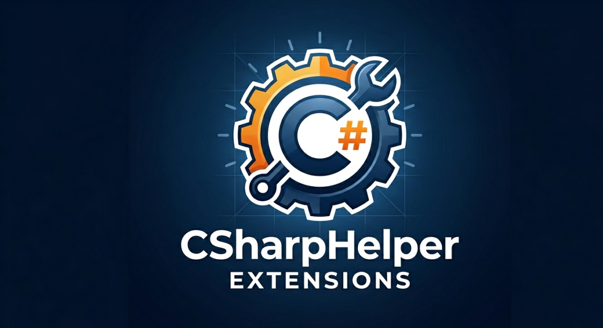

# CSharpHelperExtensions

A set of commonly used C# extension methods that reduce boilerplate across three focused namespaces: value checks, string manipulation, and collection operations.

[](https://github.com/rbipin/dry-extensions-csharp/actions/workflows/dotnet.yml)

## Installation

```bash
dotnet add package CSharpHelperExtensions
```

## Namespaces

Import the namespace for the extensions you need:

| Namespace | What it covers |
|---|---|
| `CSharpHelperExtensions.Values` | `In`, `IsBetween`, `ToJson` |
| `CSharpHelperExtensions.Strings` | All `string` extensions |
| `CSharpHelperExtensions.Enumerable` | All `IEnumerable<T>` and collection extensions |

## Interactive Samples

The `sample/` folder contains three [.NET Interactive](https://github.com/dotnet/interactive) notebooks you can run directly in VS Code (with the [Polyglot Notebooks](https://marketplace.visualstudio.com/items?itemName=ms-dotnettools.dotnet-interactive-vscode) extension) or Jupyter.

**Before running any notebook**, build the library so the DLL is available:

```bash
dotnet build
```

Each notebook loads the compiled DLL and imports the relevant namespace in its **Setup** cell — run that cell first, then run any section independently.

| Notebook | Namespace | What it covers |
|---|---|---|
| [`sample/value-extensions.ipynb`](sample/value-extensions.ipynb) | `CSharpHelperExtensions.Values` | `In`, `IsBetween` (all four `BetweenComparison` modes), `ToJson`, and chaining examples |
| [`sample/string-extensions.ipynb`](sample/string-extensions.ipynb) | `CSharpHelperExtensions.Strings` | All 50+ string methods grouped by category: null-safety, parsing, transformation, whitespace, comparisons, prefix/suffix, encoding, and chaining pipelines |
| [`sample/enumerable-extension.ipynb`](sample/enumerable-extension.ipynb) | `CSharpHelperExtensions.Enumerable` | All collection methods: presence checks, materialization, async projection, partitioning, batching, conditional mutation, and chaining pipelines |

## Usage

### Values

```csharp
using CSharpHelperExtensions.Values;

// Membership check — like SQL IN
"admin".In("admin", "superadmin");          // true
HttpMethod.Post.In(Post, Put, Patch);       // true

// Range check — inclusive by default
5.IsBetween(1, 10);                         // true
1.IsBetween(1, 10, BetweenComparison.ExcludeBoth);  // false

// JSON serialisation via Newtonsoft.Json
new { Name = "Alice", Age = 30 }.ToJson();              // {"Name":"Alice","Age":30}
new { Name = "Alice" }.ToJson(indentation: true);        // pretty-printed
```

### Strings

```csharp
using CSharpHelperExtensions.Strings;

// Null-safety
"  ".IsNullOrEmpty();                       // true (checks whitespace)
"hello".HasValue();                         // true
((string)null).OrDefault("N/A");            // "N/A"

// Transformation
"  Hello World  ".TrimToLower();            // "hello world"
"café au lait".ToSlug();                    // "cafe-au-lait"
"4111111111111234".MaskStart(4);            // "************1234"

// Safe parsing — returns null instead of throwing
"42".ToIntOrNull();                         // 42
"abc".ToIntOrNull();                        // null

// Comparisons
"Hello".EqualsIgnoreCase("HELLO");          // true
"path/".EnsurePrefix("/");                  // "/path/"
"report.csv".TrimSuffix(".csv");            // "report"

// Encoding
"Hello".Base64Encode();                     // "SGVsbG8="
"Hello".ToBase64Url();                      // URL-safe, no padding chars
```

### Enumerable

```csharp
using CSharpHelperExtensions.Enumerable;

// Null-safe presence checks
list.HasAny();                              // non-null and non-empty
list.None();                                // null or empty
list.OrEmpty();                             // null → empty sequence

// Filtering
items.WhereNotNull();                       // removes null elements
strings.CleanNullOrEmptyItems();            // removes null, empty, and whitespace strings

// Async projection with optional concurrency cap
var results = await ids.SelectAsync(FetchAsync, maxParallel: 4);

// Splitting
var (passed, failed) = scores.Partition(s => s >= 60);
var batches = items.Batch(100);             // process in chunks

// Conditional building — fluent, returns same list
var tags = new List<string>()
    .AddIf(isPremium, "premium")
    .AddIf(isAdmin, "admin");

// Min/Max that return default instead of throwing on empty
people.MinByOrDefault(p => p.Age);
people.MaxByOrDefault(p => p.Age);

// Utilities
42.Yield();                                 // wrap a single value as IEnumerable<T>
items.WithIndex();                          // (Index, Item) tuples
names.JoinAsString(", ");                   // fluent string.Join
```

## Building and Testing

```bash
# Build
dotnet build

# Run all tests
dotnet test

# Run tests with output
dotnet test --verbosity normal

# Run a specific test
dotnet test --filter "FullyQualifiedName~MethodName"
```
